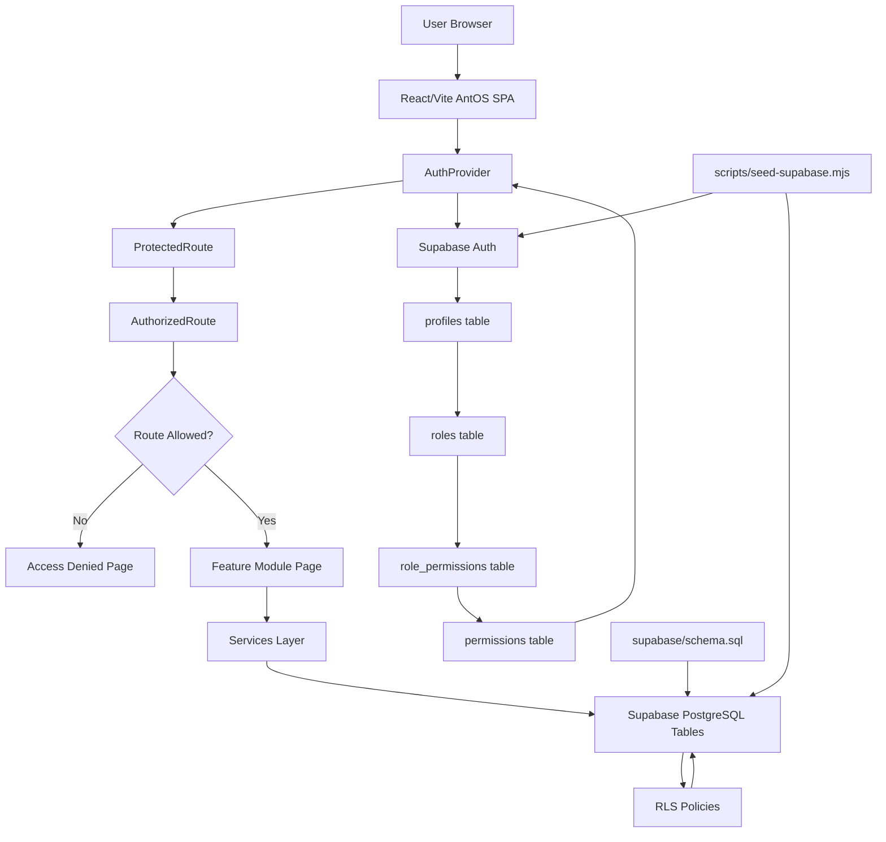

# System Architecture

AntOS is a React + Vite single-page application backed by Supabase Auth and Supabase PostgreSQL. The frontend contains route guards, role-aware navigation, feature pages, and a service layer that reads and writes Supabase tables. Supabase provides authentication, database storage, and Row Level Security.

This is not a microservices architecture. There are no independently deployed backend services per module. AntOS is a modular frontend connected to Supabase Backend-as-a-Service.

## Major Components

- React/Vite SPA: the browser application rendered from `src/app/routes.tsx` and feature pages.
- AuthProvider: `src/auth/AuthProvider.tsx` restores sessions, signs users in, fetches profile, role, and permissions, and exposes auth state.
- ProtectedRoute: blocks unauthenticated users and applies account lifecycle redirects.
- AuthorizedRoute: checks `routePermissions` and renders Access Denied when a user opens a restricted URL.
- Supabase Auth: authenticates users and stores the browser session through the Supabase client.
- Profiles/RBAC tables: `profiles`, `roles`, `permissions`, and `role_permissions` connect auth users to AntOS roles and permissions.
- Services layer: Supabase-backed services for attendance, leave, payroll, timesheets, finance, and dashboard aggregates.
- Feature modules: React pages under `src/features`.
- Supabase PostgreSQL: ERP tables defined in `supabase/schema.sql`.
- RLS policies: least-privilege table policies in `supabase/schema.sql`.
- Seed script: `scripts/seed-supabase.mjs` creates demo users, RBAC data, profiles, and sample records using a service role key from `.env.seed`.
- Environment files: `.env.local` for frontend public Supabase values, `.env.seed` for local seed-only service role access.

## System Diagram

## Data Access Pattern

1. The browser loads the React app.
2. `AuthProvider` restores a Supabase session or demo fallback session.
3. In Supabase mode, the provider fetches the user's `profiles` row, joined role, and role permissions.
4. `ProtectedRoute` checks authentication and lifecycle status.
5. `AuthorizedRoute` checks route permissions.
6. Feature pages call service functions.
7. Services call Supabase using the anon key and the user's session.
8. RLS policies decide which rows the user can read or write.

## Deployment Shape

The frontend can be deployed as static Vite assets, for example on Vercel. Supabase remains the backend platform for Auth and Postgres. The deployed frontend must only receive `VITE_SUPABASE_URL` and `VITE_SUPABASE_ANON_KEY`; the service role key belongs only in seed/admin environments.
