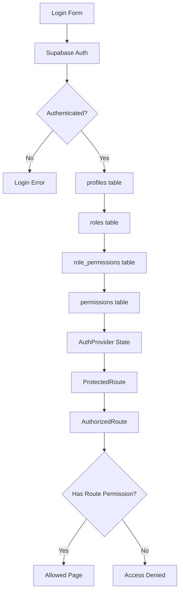

# Auth, RBAC, And Lifecycle Flow

AntOS authentication is centralized in `AuthProvider`. In Supabase mode, login uses Supabase Auth. After authentication, the app loads the user's `profiles` row, role, and permissions before rendering protected pages.

## Flow Summary

- Login: `AuthProvider.login()` calls `supabase.auth.signInWithPassword`.
- Session restore: `supabase.auth.getSession()` restores an existing browser session.
- Profile fetch: `profiles` is queried by `auth.users.id`.
- Role fetch: `profiles.role_id` joins to `roles`.
- Permission fetch: `role_permissions` joins to `permissions`.
- Route protection: `ProtectedRoute` blocks unauthenticated users and lifecycle-blocked users.
- Route authorization: `AuthorizedRoute` checks `routePermissions`.
- Sidebar filtering: `roleSidebarPaths` controls visible navigation.
- Direct URL protection: restricted URLs render Access Denied instead of relying only on hidden sidebar links.

## Auth/RBAC Diagram



## Lifecycle Redirects

```mermaid
flowchart TD
  A[Authenticated User] --> B{Profile Status}
  B -- Active --> C[Allowed Dashboard/Page]
  B -- Suspended --> D[/account-disabled]
  B -- Exited --> D
  B -- Invited --> E[/complete-profile]
  B -- Pending Profile Completion --> E
  B -- Pending Verification Student --> F[/pending-verification]
  B -- Pending Partner Approval --> F
```

## Key Code Points

- `src/auth/AuthProvider.tsx`: session restore, Supabase login, profile loading, permission loading, demo fallback.
- `src/auth/ProtectedRoute.tsx`: authentication and lifecycle redirects.
- `src/auth/AuthorizedRoute.tsx`: route-level permission gate.
- `src/auth/permissions.ts`: permission names, role permissions, route permission map, sidebar path map.
- `src/components/layout/Sidebar.tsx`: role-aware sidebar filtering.

## Demo Fallback

When `VITE_SUPABASE_URL` and `VITE_SUPABASE_ANON_KEY` are missing, AntOS uses demo users and browser session storage. This is a local review fallback, not production ERP persistence.
