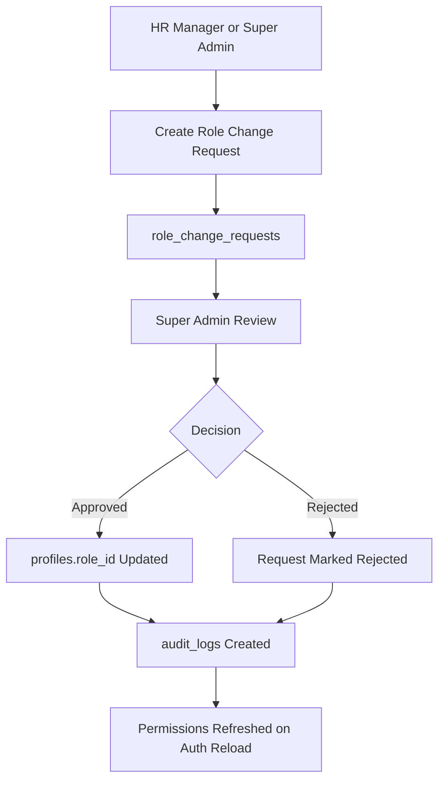

# Onboarding And Invitation Flow

AntOS uses invitation-first onboarding for employees, interns, and privileged internal accounts. Public login does not grant a role by itself; Supabase-authenticated users must have a valid AntOS `profiles` row.

## Invitation Model

- Super Admin can create invitations for any role.
- HR Manager can create invitations only for Employee and Intern roles.
- Employee and Intern access is invitation-based.
- Student self-registration is not implemented as a general public registration flow in the current code. Student access exists through seeded/demo/profile-based accounts.
- Corporate Partner accounts can exist with pending partner approval lifecycle status.
- Pending profile users are sent to `/complete-profile`.
- Student and partner verification states are sent to `/pending-verification`.

## Invitation Flow

```mermaid
flowchart TD
  A[Super Admin or HR Manager] --> B[Create Invitation]
  B --> C[user_invitations]
  C --> D[User Accepts Invite / Logs In]
  D --> E[Supabase Auth User]
  E --> F[acceptPendingInvitationForUser]
  F --> G[profiles Created or Updated]
  G --> H[onboarding_tasks Generated]
  H --> I[/complete-profile]
  I --> J[Profile Details Saved]
  J --> K{Role Type}
  K -- Employee/Admin --> L[Status Active]
  K -- Student --> M[Status Pending Verification]
  K -- Corporate Partner --> N[Status Pending Partner Approval]
  L --> O[audit_logs + notifications]
  M --> O
  N --> O
```

## Role Change Request Flow



## Supporting Tables

- `user_invitations`: invitation records, target role, target department, expiry, accepted/revoked state.
- `profiles`: account identity, role mapping, lifecycle status, employee/student/partner mapping.
- `onboarding_tasks`: generated account setup tasks.
- `role_change_requests`: requested role transitions.
- `audit_logs`: audit trail for lifecycle and admin activity.
- `notifications`: account and workflow notifications.

## Code References

- `src/features/admin/InvitationsPage.tsx`
- `src/features/admin/RoleChangeRequestsPage.tsx`
- `src/features/account/CompleteProfilePage.tsx`
- `src/lib/onboardingAutomation.ts`
- `src/auth/AuthProvider.tsx`
