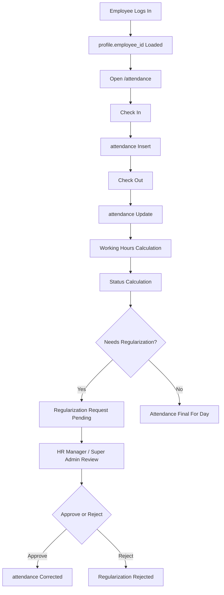
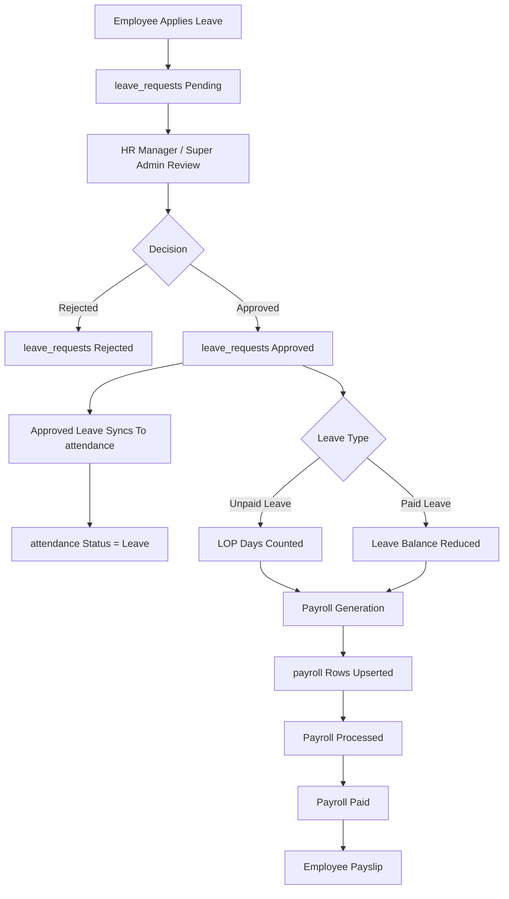

# Attendance To Leave To Payroll Flow

Attendance, Leave, and Payroll are Supabase-backed workflows. Each feature has a service under `src/services` and a React page under `src/features`.

## Attendance Flow

Employees and interns use their `profile.employee_id` mapping to read and write their own attendance rows. HR and Super Admin can review broader attendance data according to permissions and RLS.

## Leave And Payroll Flow

## Business Rules Reflected In Code

- Check-in inserts an attendance row for an employee/date.
- Check-out updates the same row and calculates working hours.
- Attendance status is calculated from check-in/check-out timing.
- Regularization stores corrected times, reason, approval status, approver, and remarks.
- Leave starts as `Pending`.
- Approved leave calls leave-to-attendance sync.
- Unpaid approved leave contributes to LOP.
- Payroll generation reads employees, leave/LOP data, and payroll records from Supabase.
- Net salary uses: Basic Salary + Allowances - Deductions - LOP.
- Employees can view only their own payroll through self-scoped service calls and RLS.

## Code References

- `src/services/attendanceService.ts`
- `src/services/leaveService.ts`
- `src/services/payrollService.ts`
- `src/features/attendance/AttendancePage.tsx`
- `src/features/leave/LeavePage.tsx`
- `src/features/payroll/PayrollPage.tsx`
- `supabase/schema.sql`
