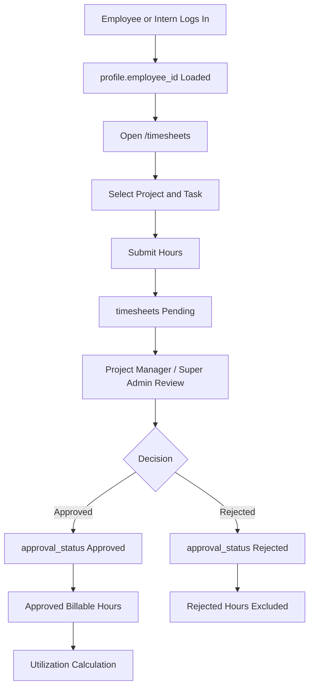
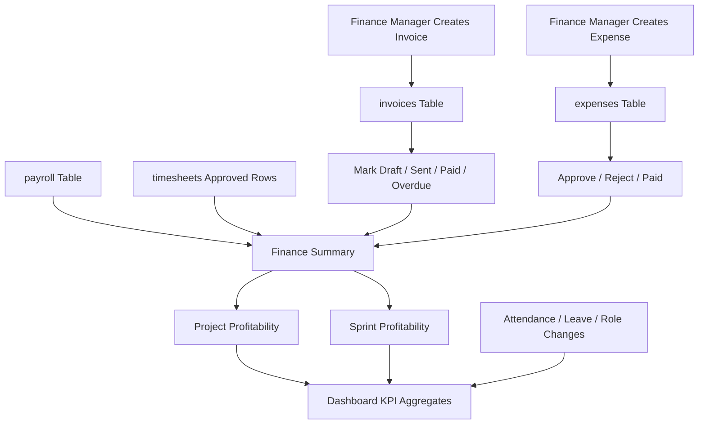

# Timesheets To Finance To Dashboard Flow

Timesheets, Finance, and Dashboard aggregates are Supabase-backed in the current codebase. Project/task master pages still use shared placeholder UI, but the timesheet submission and finance calculations use Supabase services.

## Timesheet Flow

## Finance And Dashboard Flow

## Metrics

- Utilization: Approved Billable Hours / Total Approved Hours * 100.
- Monthly revenue: paid invoice revenue in the selected period.
- Payroll cost: payroll net salary totals.
- Operational expenses: approved/paid expense values where applicable.
- Project profitability: invoices plus approved timesheet labor cost and expenses where related data exists.
- Sprint profitability: sprint invoice/expense calculations where related data exists.
- Dashboard pending approvals: leave, attendance regularization, timesheets, expenses, invoices, role changes, invitations, and at-risk projects.

## Code References

- `src/services/timesheetService.ts`
- `src/services/financeService.ts`
- `src/services/dashboardService.ts`
- `src/features/timesheets/TimesheetsPage.tsx`
- `src/features/finance/FinancePage.tsx`
- `src/features/dashboard/DashboardPage.tsx`
