# Database ER Diagram

The diagram below focuses on primary relationships used by the current AntOS schema and services. Supabase Auth owns `auth.users`; application tables live in the `public` schema.

```mermaid
erDiagram
  AUTH_USERS ||--|| PROFILES : "id"
  ROLES ||--o{ PROFILES : "assigned_to"
  ROLES ||--o{ ROLE_PERMISSIONS : "role_id"
  PERMISSIONS ||--o{ ROLE_PERMISSIONS : "permission_id"

  DEPARTMENTS ||--o{ EMPLOYEES : "department_id/head_id"
  EMPLOYEES ||--o{ PROFILES : "employee_id"
  STUDENTS ||--o{ PROFILES : "student_id"
  CORPORATE_PARTNERS ||--o{ PROFILES : "corporate_partner_id"

  EMPLOYEES ||--o{ ATTENDANCE : "employee_id"
  EMPLOYEES ||--o{ LEAVE_REQUESTS : "employee_id"
  EMPLOYEES ||--o{ PAYROLL : "employee_id"
  EMPLOYEES ||--o{ TIMESHEETS : "employee_id"

  CORPORATE_PARTNERS ||--o{ PROJECTS : "corporate_partner_id"
  EMPLOYEES ||--o{ PROJECTS : "manager_id"
  PROJECTS ||--o{ TASKS : "project_id"
  EMPLOYEES ||--o{ TASKS : "assigned_to"
  PROJECTS ||--o{ TIMESHEETS : "project_id"
  TASKS ||--o{ TIMESHEETS : "task_id"

  CAREER_SPRINTS ||--o{ SPRINT_ENROLLMENTS : "sprint_id"
  STUDENTS ||--o{ SPRINT_ENROLLMENTS : "student_id"
  CAREER_SPRINTS ||--o{ READINESS_SCORES : "sprint_id"
  STUDENTS ||--o{ READINESS_SCORES : "student_id"
  STUDENTS ||--o{ INTERN_DEPLOYMENTS : "student_id"
  CORPORATE_PARTNERS ||--o{ INTERN_DEPLOYMENTS : "corporate_partner_id"
  PROJECTS ||--o{ INTERN_DEPLOYMENTS : "project_id"
  STUDENTS ||--o{ PPO_RECORDS : "student_id"
  CORPORATE_PARTNERS ||--o{ PPO_RECORDS : "corporate_partner_id"

  CORPORATE_PARTNERS ||--o{ INVOICES : "corporate_partner_id"
  PROJECTS ||--o{ INVOICES : "project_id"
  CAREER_SPRINTS ||--o{ INVOICES : "sprint_id"
  PROFILES ||--o{ INVOICES : "created_by_profile_id"
  PROFILES ||--o{ EXPENSES : "created_by_profile_id"
  PROFILES ||--o{ EXPENSES : "approved_by_profile_id"

  EMPLOYEES ||--o{ ASSETS : "employee_id"
  PROFILES ||--o{ DOCUMENTS : "owner_profile_id"
  EMPLOYEES ||--o{ DOCUMENTS : "employee_id"
  STUDENTS ||--o{ DOCUMENTS : "student_id"
  CORPORATE_PARTNERS ||--o{ DOCUMENTS : "corporate_partner_id"
  PROFILES ||--o{ TICKETS : "raised_by_profile_id"
  PROFILES ||--o{ TICKETS : "assigned_to_profile_id"

  PROFILES ||--o{ NOTIFICATIONS : "user_id"
  ROLES ||--o{ USER_INVITATIONS : "role_id"
  DEPARTMENTS ||--o{ USER_INVITATIONS : "department_id"
  PROFILES ||--o{ ROLE_CHANGE_REQUESTS : "user_id"
  ROLES ||--o{ ROLE_CHANGE_REQUESTS : "old/new_role_id"
  PROFILES ||--o{ AUDIT_LOGS : "actor_user_id"
  PROFILES ||--o{ ONBOARDING_TASKS : "profile_id"
  PROFILES ||--o{ APPROVAL_REQUESTS : "requester/approver"
  PROFILES ||--o{ USER_SECURITY_EVENTS : "user_id"
```

## Table Groups

- Identity/RBAC: `auth.users`, `profiles`, `roles`, `permissions`, `role_permissions`.
- People: `employees`, `students`, `corporate_partners`, `departments`.
- HR operations: `attendance`, `leave_requests`, `payroll`.
- Delivery operations: `projects`, `tasks`, `timesheets`, `intern_deployments`.
- Career programs: `career_sprints`, `sprint_enrollments`, `readiness_scores`, `ppo_records`.
- Finance: `invoices`, `expenses`.
- Support and governance: `assets`, `documents`, `tickets`, `notifications`, `user_invitations`, `role_change_requests`, `audit_logs`, `onboarding_tasks`, `approval_requests`, `user_security_events`.
