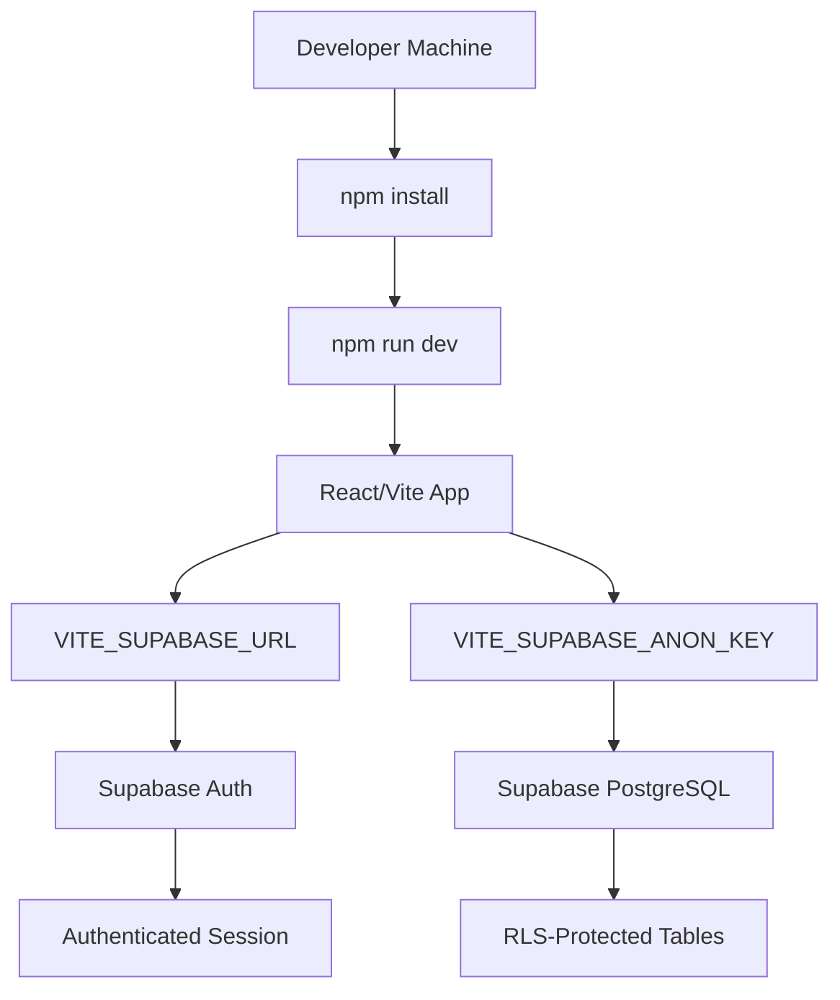
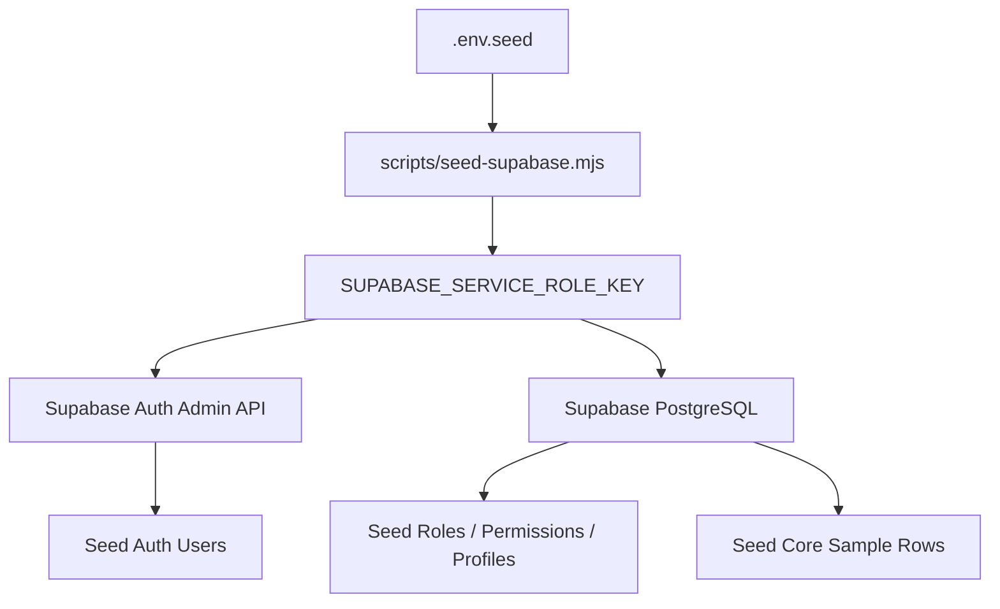
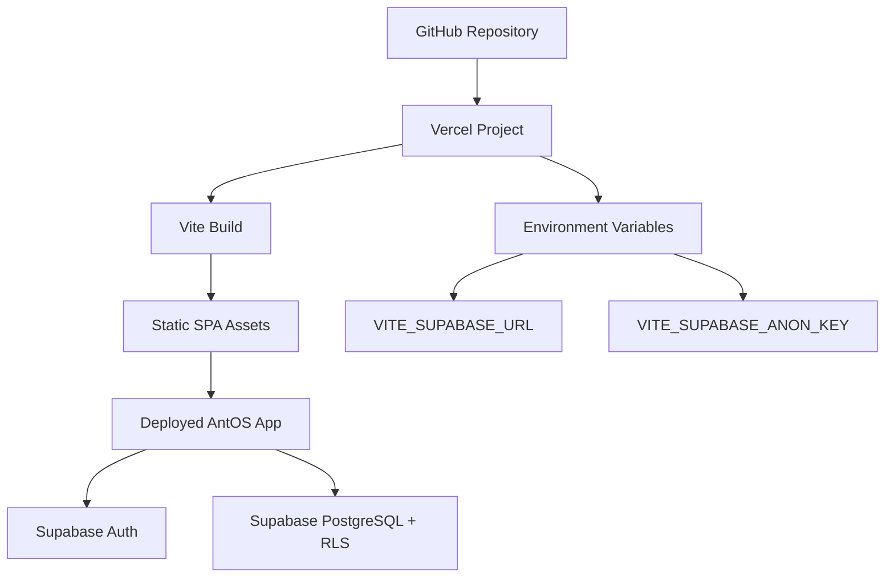

# Deployment And Environment Flow

AntOS has two operating modes:

- Supabase mode: production-like mode using Supabase Auth and Supabase PostgreSQL.
- Demo fallback mode: local review mode used only when frontend Supabase env variables are missing.

## Local Development



## Supabase Setup

1. Create a Supabase project.
2. Run `supabase/schema.sql` in the Supabase SQL Editor.
3. Add frontend env variables to `.env.local`:

```env
VITE_SUPABASE_URL=
VITE_SUPABASE_ANON_KEY=
```

4. Add seed-only env variables to `.env.seed`:

```env
SUPABASE_URL=
SUPABASE_SERVICE_ROLE_KEY=
```

5. Run `npm run seed:supabase`.

## Seed Flow



The service role key is required only for administrative seeding. It must not be used in frontend code or `VITE_` variables.

## Vercel Deployment Flow



## Required Frontend Variables

- `VITE_SUPABASE_URL`
- `VITE_SUPABASE_ANON_KEY`

## Seed/Admin Variables

- `SUPABASE_URL`
- `SUPABASE_SERVICE_ROLE_KEY`

## Safety Rules

- Do not expose `SUPABASE_SERVICE_ROLE_KEY` in frontend env variables.
- Do not commit `.env.local` or `.env.seed`.
- Use the anon key in frontend only.
- Use the service role key only from `.env.seed` or secure CI secret storage.
- Configure hosting SPA fallback so refreshed routes load `index.html`.
