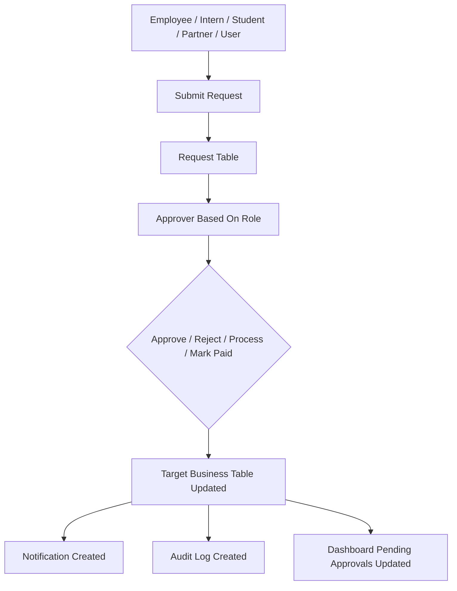

# Approval Workflow Architecture

AntOS uses role-based approval workflows. Requests are stored in module tables, reviewed by authorized roles, and then resolved into the target business record. Notifications and audit logs are used where the current helper functions are integrated.

## Approval Flow

## Approver Mapping

| Workflow | Request Table | Approver |
| --- | --- | --- |
| User invitation | `user_invitations` | Super Admin for all roles; HR Manager for Employee and Intern invitations only. |
| Role change | `role_change_requests` | Super Admin approves/rejects role changes. HR can request role changes. |
| Attendance regularization | `attendance` | HR Manager / Super Admin. |
| Leave approval | `leave_requests` | HR Manager / Super Admin. |
| Timesheet approval | `timesheets` | Project Manager / Super Admin. |
| Payroll processing | `payroll` | HR Manager / Finance Manager / Super Admin when permission exists. |
| Expense approval/payment | `expenses` | Finance Manager / Super Admin. |
| Invoice/payment status | `invoices` | Finance Manager / Super Admin. This is status management rather than a separate approval request table. |

## Workflow Details

### User Invitation

Super Admin and permitted HR users create `user_invitations`. The invitation is accepted during first Supabase login when `AuthProvider` cannot find a profile and calls invitation acceptance logic. This creates or updates `profiles`, marks the invitation accepted, and generates onboarding tasks.

### Role Change

HR or Super Admin creates a `role_change_requests` row. Super Admin approves or rejects. Only approved requests update `profiles.role_id`.

### Attendance Regularization

Employee submits corrected check-in/check-out details on an attendance row. HR approves or rejects. Approval updates regularization status, corrected time fields, approver, remarks, working hours, and final status.

### Leave

Employee inserts a `leave_requests` row with `Pending` status. HR approves or rejects. Approval saves approver metadata and syncs approved leave dates to `attendance` as `Leave`. Unpaid approved leave contributes to payroll LOP.

### Timesheets

Employee or Intern submits a timesheet row with `Pending` status. Project Manager approves or rejects. Approved billable hours contribute to utilization and profitability calculations.

### Payroll

HR, Finance, or Super Admin generates payroll rows. Payroll can move from Draft to Processed and then Paid. Employee users see only their own payslip.

### Expenses

Finance Manager creates expenses. Expenses can be approved, rejected, and marked paid. Approved/paid expenses feed finance KPIs and profitability.

### Invoices

Finance Manager creates invoices and marks them Sent, Paid, or Overdue. Invoice status contributes to monthly revenue, pending invoices, overdue invoices, and profitability.
