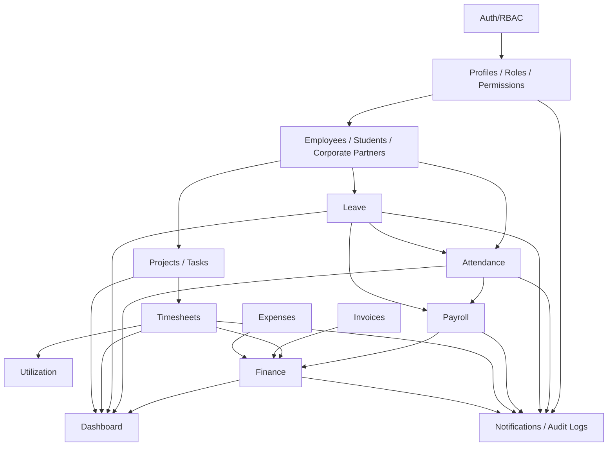

# Module Dependency Map

AntOS modules are organized as a modular frontend with shared identity, RBAC, workflow, and data services.

## Dependency Notes

- Auth/RBAC is the gate for every protected module.
- Profiles connect Supabase Auth users to employee, student, or corporate partner records.
- Attendance feeds Payroll through working day status and unregularized absences.
- Leave updates Attendance when approved and feeds Payroll through unpaid leave/LOP.
- Payroll feeds Finance through payroll cost.
- Projects and Tasks provide context for Timesheets.
- Timesheets feed Utilization and Project Profitability.
- Invoices and Expenses feed Finance summaries and profitability.
- Finance and operational modules feed Dashboard KPI aggregates.
- Notifications and Audit Logs are cross-cutting governance modules.
- Remaining placeholder pages still use shared in-memory scaffolding until dedicated Supabase services are added.
